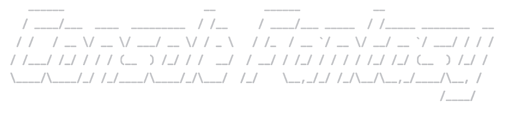

## Was ist Console Fantasy?

Console Fantasy ist ein rundenbasiertes Konsolenspiel, was durch das RPG Spiel Final Fantasy
inspiriert wurde.
---

Programmstart

Starte die Main.kt, um das Spiel zu beginnen und Bahamut zu besiegen. 

---

### Gameplay

Das Ziel ist es den Boss Bahamut mit deinem Team zu besiegen.

Dir steht ein Team aus 3 Helden zur Verfügung. Du kannst entweder ein balanciertes Team aussuchen,
was aus einem Dunkelritter, Schwarzmagier und Weissmagier besteht oder du kannst dir dein eigenes erstellen.
---
### Charakter

#### Helden

Dunkelritter

Der Dunkelritter spezialisiert sich für single target physische Angriffe und seine Verbündeten
mit einem Schild vor Angriffen zu beschützen.

Skills:

* Shield: schützt einen Helden einmalig vor einem Angriff
* Chaosklinge: physischer single target Skill
* Doppelklinge: physischer single target Skill
* Excalibur: physischer single target Skill

Schwarzmagier

Der Schwarzmagier spezialisiert sich für magische Angriffe. Neben den single target Skills
hat der Magier noch 'Ultima', was ein AOE Skill ist.

Skills:

* Stabhieb: physischer single target Skill
* Feuerball: magischer single target Skill
* Eissturm: magischer single target Skill
* Ultima: magischer AOE Skill

Weissmagier

Der Weissmagier spezialisiert sich für Hilfsskills für Verbündete wie ATK Buff, Def Buff oder Vita.

Skills:

* Basic Attack: physischer single target Skill
* ATK-Buff: erhöht die Strength und Intelligence um 20
* Def-Buff: erhöht die Defense und Magic Defense 10
* Vita: heilt 25% HP eines Verbündeten 

#### Gegner

Bahamut

Bahamut ist der Boss, den du in diesem Konsolenspiel besiegen musst. Neben physischen Angriffen besitzt er auch
einen magischen AOE Skill und kann den Helden vergiften.

Skills:

* Drachenklaue: physischer single target Skill
* Feura: magischer single target Skill
* Himmelszorn: physischer single target Skill
* Supernova: magischer AOE Skill
* Poison Strike: vergiftet den Gegner und fügt ihm prozentualen Schaden zu (wird erst nach dem Beschwören angewendet)
* Summon:  beschwört 2 Wyvern in sein Team

Wyvern

Wyvern helfen Bahamut dabei dich zu besiegen und erschweren dir den Kampf.

Skills:
* Biss: physischer single target Skill
* Blizzard: magischer single target Skill
* Eisatem: magischer single target Skill
* Blaue Flamme: magischer single target Skill

---

### Items

Während des Kampfes hast du Zugriff auf ein Inventar, das Items enthält, welche dir beim
Kampf helfen können.

* Heiltrank: heilt 300HP
* Allheilmittel: entfernt den Status "Gift"
* Stärkungstrank: erhöht Strength um 15
* Intelligenztrank: erhöht Intelligence um 15

UML Diagramm

